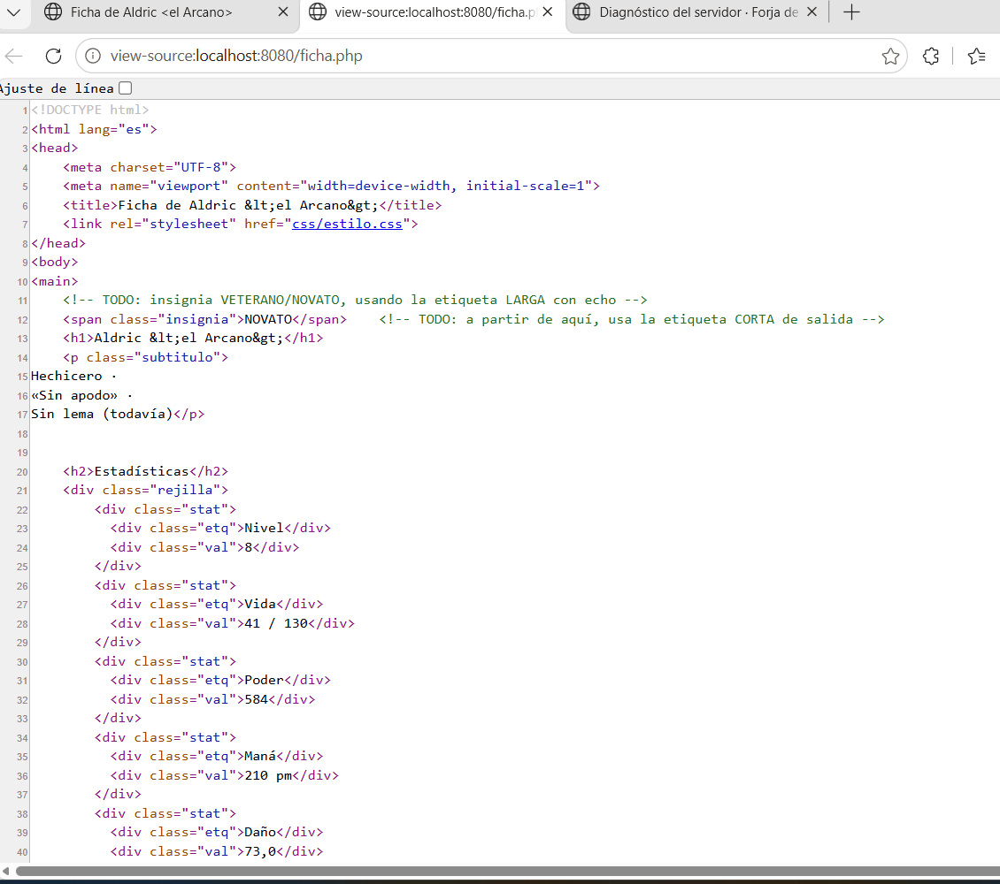
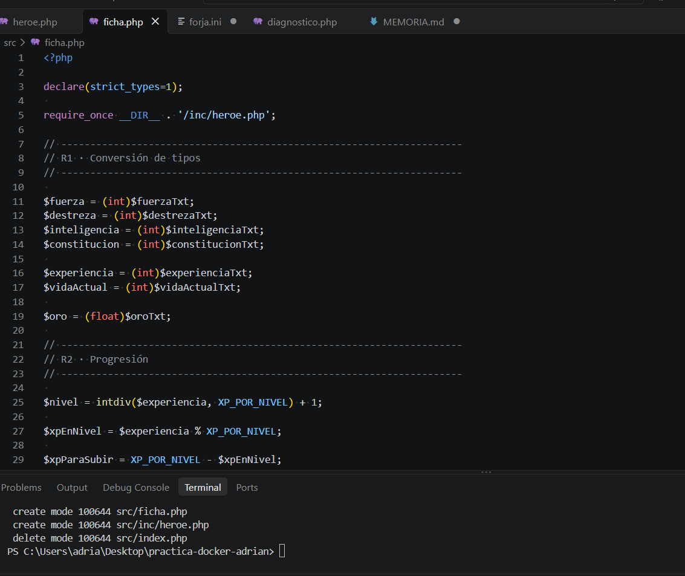
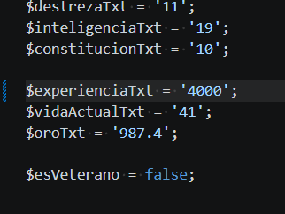
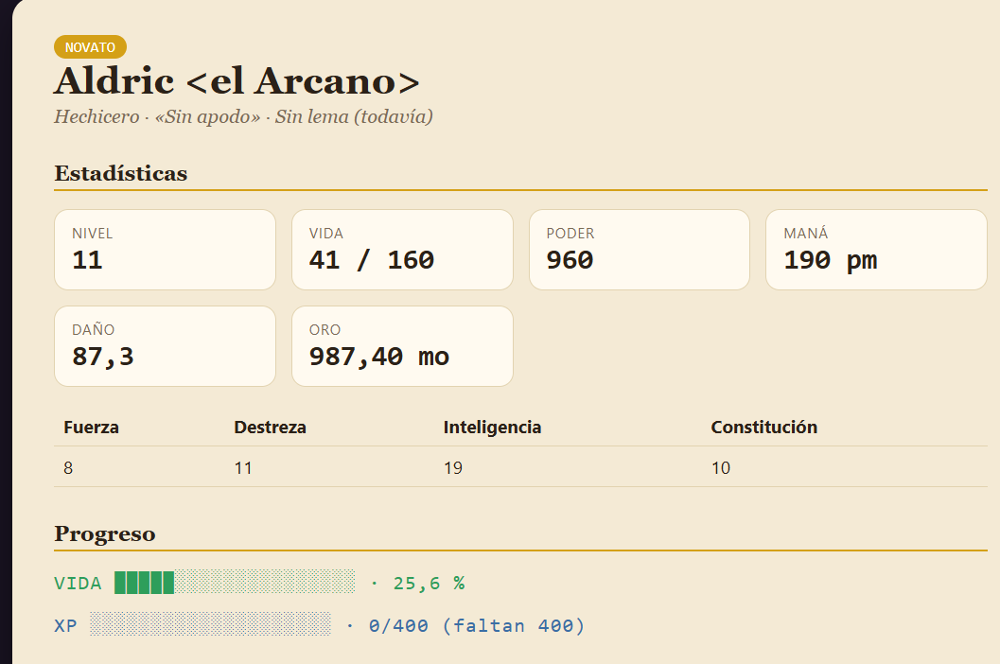
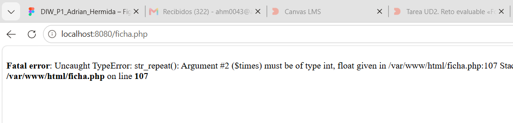
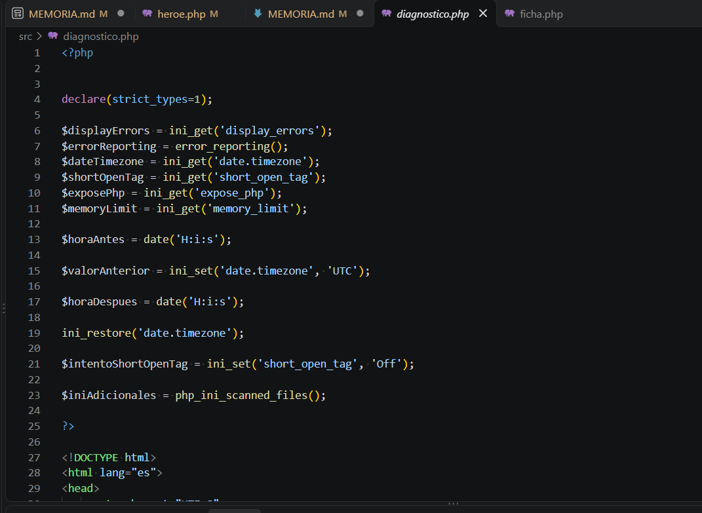

# Memoria · Reto UD2 «Forja de Héroes»

Alumno/a: Adrian Hermida Moreno  · **Variante:** B  · **Fecha:** 7 Octubre 

## 1. Comprobación de resultados (CE 2.e)

Rellena la tabla con los valores que muestra TU ficha y compáralos con la tabla de comprobación del enunciado.

| Dato | Valor esperado (enunciado) | Valor de mi ficha | ¿Coincide? |
---------------------------------------------------------------------
| Nivel|  8                         |  8                |   Si       |
----------------------------------------------------------------------
| Vida 
  Máxima|  130                      |  130              |   Si       |
----------------------------------------------------------------------
| % Vida|  31,5                     |  31,5             |   Si       |
----------------------------------------------------------------------
| Daño  |  73                       |  73               |  Si        |
----------------------------------------------------------------------
| Especial|  210 pm                 |  210 pm           |  Si        |
----------------------------------------------------------------------
| Poder |  584                      |  584              |  Si        |
----------------------------------------------------------------------
| Result|  -1 (Desventaja)          |  -1 (Desventaja)  |  Si        |

## 2. El código fuente y el documento resultante (CE 2.e · CE 2.c)

La diferencia fundamental es que en el archivo php se incluye la logica de programacion ( calculos , instrucciones php , etc...) mientras que en el documento aparecen los valores calculados y codigo html preaparado para mostrarse. 

## 3. Experimento: cambio un dato y predigo el efecto (CE 2.e)

En este experimento he modificado la experiencia del personaje, esperando que suba de nivel y aumenten asi todos los elementos que dependen de el (vida , poder , mana etc). 

Tras comprobar el resultado del experimento , puedo afirmar que tanto el nivel , como el resto de elementos que dependen de el han aumentado. 

## 4. Experimento con strict_types (CE 2.f)

He quitado el (int) de los bloques de la barra de vida, he recargado y me ha aparecido el siguiente error. 

La captura del error nos muestra un TypeError en la funcion  str_repeat().  Se esperaba recibir un valor int pero recibio un valor float , debido a que borramos (int) que es el encargado de convertir dicho valor. 
Creo que lo mejor es usar strict_types=1 ya que nos obliga a utilizar los tipos de datos correctamente y detecta errores durante la fase de desarrollo. 

## 5. Directivas (CE 2.f)

En un servidor de produccion usaria "display_errors= Off" debido a que los mensajes de error puede mostrar informacion interna de la aplicacion. Esto puede derivar en un error de seguridad , por lo que conviene limitar la visibilidad de la producción a los administradores del sistema. 

## 6. Uso de IA (obligatorio declararlo)

Sí, he utilizado inteligencia artificial durante el desarrollo de la actividad.

Principalmente he utilizado Microsoft Copilot como apoyo cuando me he atascado en algunos apartados de la práctica. La IA me fue guiando paso a paso mediante explicaciones y pequeños tutoriales, permitiéndome entender qué debía hacer en cada momento en lugar de limitarse a darme la solución completa.

La mayor ayuda se produjo durante la configuración del entorno Docker, la resolución de errores de PHP, la implementación de las barras de progreso, el uso de heredoc, el operador ".=", la configuración de diagnostico.php y la interpretación de mensajes de error relacionados con strict_types y str_repeat().

Para comprobar que las soluciones eran correctas fui enviando capturas de pantalla del código y de los resultados obtenidos, de forma que cada paso pudiera verificarse antes de continuar con el siguiente.

Además, la inteligencia artificial integrada en Visual Studio Code me ayudó en algunos casos concretos en los que necesitaba ayuda con la sintaxis o con pequeños detalles técnicos. Un ejemplo fue la inserción correcta de imágenes en la memoria mediante Markdown, donde me ayudó a identificar la sintaxis adecuada.

También utilicé la IA como apoyo para redactar algunas explicaciones de la memoria y mejorar la presentación de los textos, manteniendo siempre la revisión y comprensión personal del contenido antes de incorporarlo al documento final.

